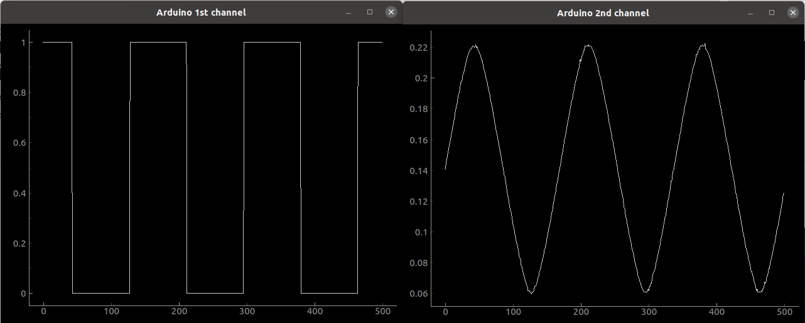

# pyFirmata2



PyFirmata2 turns your Arduino into a data acquisition card controlled by Python.

Up to 1kHz precise sampling at the analogue ports for digital filtering.

Just upload the default firmata sketch into your Arduino and you are all set.

pyFirmata2 is an updated version of pyFirmata which *replaces loops
with callbacks*. Instead of unreliable "sleep" commands in a loop the
Python application registers callbacks which are then called
every time after new data has arrived. This means for the analogue
channels the callbacks are called at the specified sampling rate
while the digital ports call the callback functions after
a state change at the port (from 0 to 1 or 1 to 0).

This API has been used in the Digital Signal Processing (DSP) class to
practise realtime filtering of analogue sensor
data. Examples can be viewed on the YouTube channel of the
class: https://www.youtube.com/user/DSPcourse


## Installation


### Upload firmata


Install the Arduino IDE on your computer: https://www.arduino.cc/en/Main/Software

Start the IDE and upload the standard firmata sketch into your Arduino with:
```  
    File -> Examples -> Firmata -> Standard Firmata
```


### Install pyfirmata2


The preferred way to install is with `pip` / `pip3`. Under Linux:
```
    pip3 install pyfirmata2 [--user] [--upgrade]
```
    
and under Windows/Mac type:
```  
    pip install pyfirmata2 [--user] [--upgrade]
```
    
You can also install from source with:
```
    git clone https://github.com/berndporr/pyFirmata2
    cd pyFirmata2
```

Under Linux type:
```  
    python3 setup.py install
```

Under Windows / Mac:
```
    python setup.py install
```

## Usage


### Initialisation

Create an instance of the `Arduino` class:
```
PORT =  pyfirmata2.Arduino.AUTODETECT
board = pyfirmata2.Arduino(PORT)
```
which automatically detects the serial port of the Arduino.

If this fails you can also specify the serial port manually, for example:
```
board = pyfirmata2.Arduino('COM4')
```
Under Linux this is usually `/dev/ttyACM0`. Under Windows this is a
COM port, for example `COM4`. On a MAC it's `/dev/ttys000`, `/dev/cu.usbmodem14101` or
check for the latest addition: `ls -l -t /dev/*`.


### Starting sampling at a given sampling interval

In order to sample analogue data you need to specify a sampling
interval in ms which then applies to all channels. The smallest
interval is 1ms:
```
board.samplingOn(samplinginterval in ms)
```
Calling `samplingOn()` without its argument sets the sampling interval
to 19ms.


### Enabling and reading from analogue or digital input pins

To receive data register a callback
handler and then enable it:
```
    board.analog[0].register_callback(myCallback)
    board.analog[0].enable_reporting()
```    
where `myCallback(data)` is then called every time after data has been received
and is timed by the arduino itself. For analogue inputs that's at
the given sampling rate and for digital ones at state changes from 0 to 1 or
1 to 0.

### Writing to a digital port

Digital ports can be written to at any time:
```  
    board.digital[13].write(True)
```
For any other functionality (PWM or servo) use the pin class below.

    
### The pin class

The command `get_pin` requests the class of a pin
by specifying a string, composed of
'a' or 'd' (depending on if you need an analog or digital pin), the pin
number, and the mode:
  - 'i' for input (digital or analogue)
  - 'u' for input with pullup (digital)
  - 'o' for output (digital)
  - 'p' for pwm (digital)
  - 's' for servo (digital)
All seperated by `:`, for example:
```
analog_in_0 = board.get_pin('a:0:i')
analog_in_0.register_callback(myCallback)
analog_in_0.enable_reporting()

digital_out_3 = board.get_pin('d:3:o')
digital_out_3.write(True)
```	
Values for analogue ports and PWM are 0..1,
for servo between 0 and 180 (degrees) and for digital ports
`True` & `False`.

```
class Pin(builtins.object)
 |  Pin(board, pin_number, type=2, port=None)
 |  
 |  A Pin representation
 |  
 |  Methods defined here:
 |  
 |  __init__(self, board, pin_number, type=2, port=None)
 |      Initialize self.  See help(type(self)) for accurate signature.
 |  
 |  __str__(self)
 |      Return str(self).
 |  
 |  disable_reporting(self)
 |      Disable the reporting of an input pin.
 |  
 |  enable_reporting(self)
 |      Set an input pin to report values.
 |  
 |  read(self)
 |      Returns the value of an output pin.
 |  
 |  register_callback(self, _callback)
 |      Register a callback to read from an analogue or digital port
 |      
 |      :arg value: callback with one argument which receives the data:
 |      boolean if the pin is digital, or 
 |      float from 0 to 1 if the pin is an analgoue input
 |  
 |  unregiser_callback(self)
 |      Unregisters the callback which receives data from a pin
 |  
 |  write(self, value)
 |      Output a voltage from the pin
 |      
 |      :arg value: Uses value as a boolean if the pin is in output mode, or
 |          expects a float from 0 to 1 if the pin is in PWM mode. If the pin
 |          is in SERVO the value should be in degrees.
 |  

```

### Closing the board

To close the serial port to the Arduino use the exit command:
```
board.exit()
```

## Example code

The directory https://github.com/berndporr/pyFirmata2/tree/master/examples 
contains two realtime Oscilloscopes with precise sampling rate,
a digital port reader, the ubiquitous flashing LED program, pwm, servo control
and
a program which prints data using the callback handler.


## Troubleshooting

### Spyder

Start your program from the (Anaconda-) console / terminal and never within Spyder. Here is
an example for Windows:
```
    (base) D:\>
    (base) D:\>cd pyFirmata2\examples
    (base) D:\pyFirmata2\examples>python realtime_two_channel_scope.py
```
The problem with Spyder is that it won't let your Python program terminate properly
which leaves the serial port in an undefined state. If you then re-run your program
it won't be able to talk to your Arduino. In the worst case you need to reboot your
computer. Bottomline: use Spyder for editing, run the program from the console / terminal.


### After an update still the old version is being used

If you use the `--user` option to install / update packages Python might keep older versions.

Solution: Do a `pip uninstall pyfirmata2` multiple times until no version is left 
on your computer. Then install it again as described above.


### Credits

The original pyFirmata was written by Tino de Bruijn.
The realtime sampling / callback has been added by Bernd Porr.
