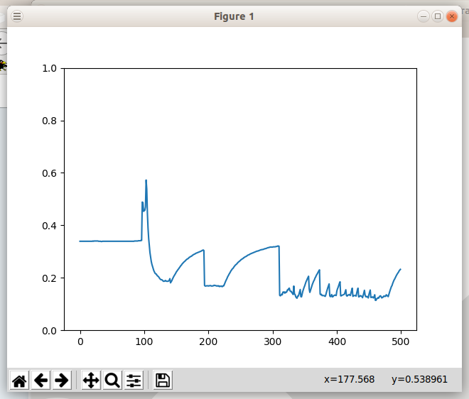

# Examples

  - Realtime oscilloscope and filtering of data. This script shows how to process data at a given sampling rate which allows filtering.
  - Printing data on the screen using an event handler
  - Digital in reads from a digital pin using a loop
  - Flashing LED using a loop
